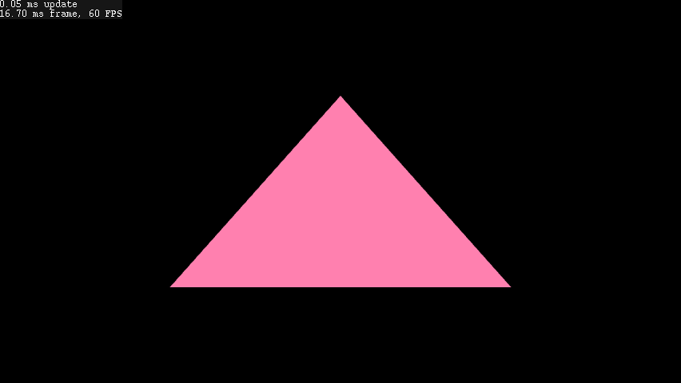

# brucelib

**WARNING: WORK IN PROGRESS**

A monorepo of [modules](#modules) for programming cross-platform games, simulations, engines and editors. Leveraging the [Zig programming language and toolchain](https://ziglang.org/), brucelib intends to be highly hackable and suitable for rapid prototyping, jams or fully-fledged products.

"Absorb what is useful, discard what is useless and add what is specifically your own” - Bruce Lee

Modules work standalone without any external dependencies and are designed to be easy to configure, extend or modify to your own specific needs, or to replace with something else in future if your project demands it. [The examples](#examples) demonstrate how one can use modules in combination with each other.

| Module | Description | Status |
| :--- | :---------- | :----- |
| [platform](modules/platform/) | Platform abstraction for windowing, graphics context creation, input, audio playback, network and file system procedures | in-progress |
| [graphics](modules/graphics/) | Graphics API abstraction, a higher-level `DrawList` API and various rendering primitives | in-progress |
| [audio](modules/audio/) | Audio mixing, synthesis (planned) and signal processsing (planned) | in-progress |
| gui | A flexible gui library with an immediate-mode interface | planned |
| asset | Data-agnostic, graph-based asset system | planned |
| algo | Implementations of commonly used algorithms in games and simulations | planned |
| build | Useful build and distribution packaging procedures to import into your build.zig | planned |

### Supported targets
The planned scope of this project is to target all the popular desktop, mobile and console platforms. Most modules have no system dependencies. Refer to the [platform](modules/platform/) and [graphics](modules/graphics/) module documentation for more information.

## Getting Started
- Copy/clone/submodule this respository
- Run all the tests with `zig build test`
- Build and run an example: e.g. `zig build run-example-000`
- List all available build targets with `zig build --help`
- Each module has a main.zig, i.e. `modules/{module_name}/main.zig`. Import in your source or build and link in your build.zig. See [build.zig](build.zig) for examples.

### Examples

| Example | Screen capture |
| ------- | -------------- |
| [000-funky triangle](examples/000_funky_triangle/): A basic demonstration of how to use the [platform](modules/platform/) and [graphics](modules/graphics/) modules to open a window and draw stuff in it. |  |

## Licenses and attribution

Each module comes with a NOTICE file with license attributions for module code and 3rd-party vendored libraries. Care has been taken to adhere to the licenses of all 3rd-party code and give proper attribution where required. The contents of module's NOTICE file must be preserved in projects that use it. Alternatively, an umbrella [NOTICE](NOTICE) is provided that covers the entire monorepo.
