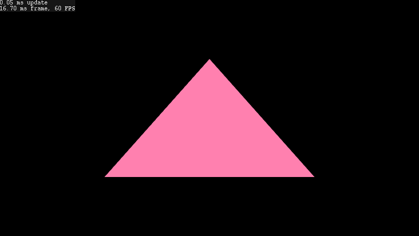

# brucelib

**WARNING: WORK IN PROGRESS**

A monorepo of modules for programming cross-platform games, simulations, engines and editors. Leveraging the [Zig programming language and toolchain](https://ziglang.org/), brucelib intends to be highly hackable and suitable for rapid prototyping, jams or fully-fledged products. Each module is designed to be easy to configure, extend or modify to your own specific needs, and to replace with something else in future if your project demands it. [The examples](#examples) demonstrate how one can use modules in combination with each other.

"Absorb what is useful, discard what is useless and add what is specifically your own” - Bruce Lee

### Supported targets
The planned scope of this project is to target all the popular desktop, mobile and console platforms. Most modules have no system dependencies. Refer to the [platform](modules/platform/) and [graphics](modules/graphics) module documentation for more information.

### Modules
| Name | Description | Status |
| :--- | :---------- | :----- |
| build | Useful build and distribution packaging procedures to import into your build.zig | planned |
| [platform](modules/platform/) | Platform abstraction for windowing, graphics context creation, input, audio playback, network and file system procedures | in-progress |
| [graphics](modules/graphics/) | Push-style graphics API abstracting low-level graphics backends, high level primitives and builtin renderers | in-progress |
| gui | Versatile gui library with an immediate-mode interface | planned |
| audio | Audio mixing, synthesis and signal processsing | planned |
| asset | Data-agnostic, graph-based asset system | planned |
| algo | Implementations of commonly used algorithms in games and simulations | planned |
| noise | Various noise generators | planned |

### Vendored libraries
Each vendored library is listed along with the modules that use it and the license it is under; see the [NOTICE](NOTICE) file for more information.
| Name | Description | Used by | License |
| :--- | :---------- | :------ | :------ |
| [zig-objcrt](vendored/zig-objcrt) | Objective-C runtime bindings lib from [here](https://github.com/hazeycode/zig-objcrt) | [platform](modules/platform/) | 0BSD |
| [zig-gamedev-win32](vendored/zig-gamedev-win32) | The win32 bindings lib from [zig-gamedev](https://github.com/michal-z/zig-gamedev) | [platform](modules/platform/), [graphics](modules/graphics/) | MIT |
| [zig-gamedev-zmath](vendored/zig-gamedev-zmath) | The zmath linear maths lib from [zig-gamedev](https://github.com/michal-z/zig-gamedev) | [graphics](modules/graphics/) | MIT |

## Getting Started
- Copy/clone/submodule this respository
- Run all the tests with `zig build test`
- Build and run an example: e.g. `zig build run-example-001`
- List all available build targets with `zig build --help`
- Each module has a main.zig, i.e. `modules/{module_name}/main.zig`. Import in your source or add as a package in your build.zig along with any vendored libs it uses. Refer to [build.zig](build.zig) for an example.

### Examples

[001-funky triangle](examples/001_funky_triangle/): A basic demonstration of how to use the [platform](modules/platform/) and [graphics](modules/graphics) modules to open a window and draw stuff in it.

